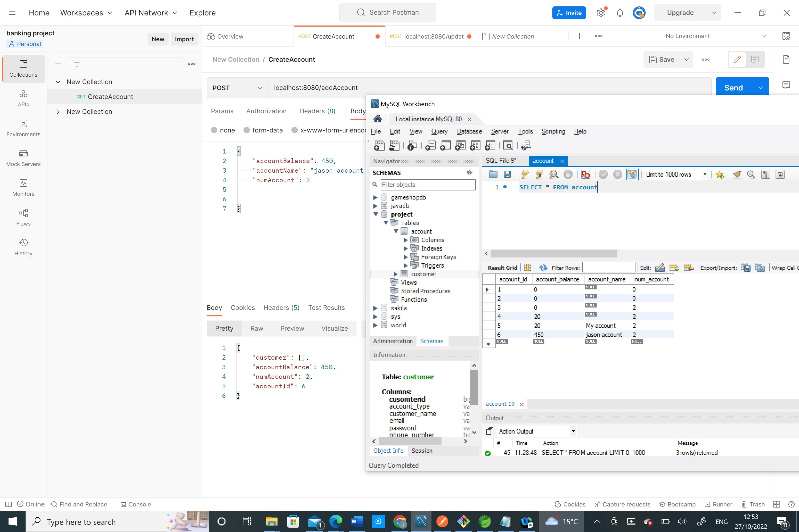
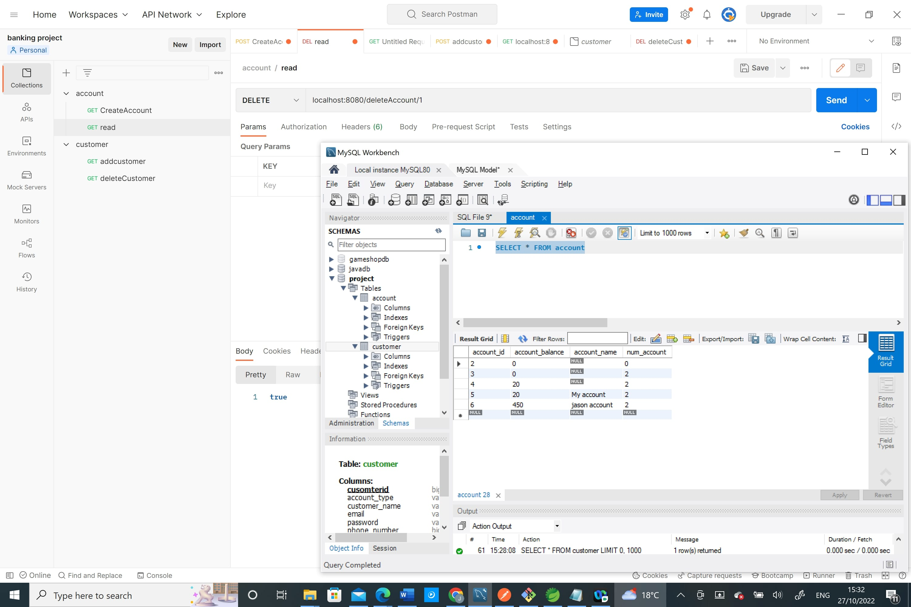
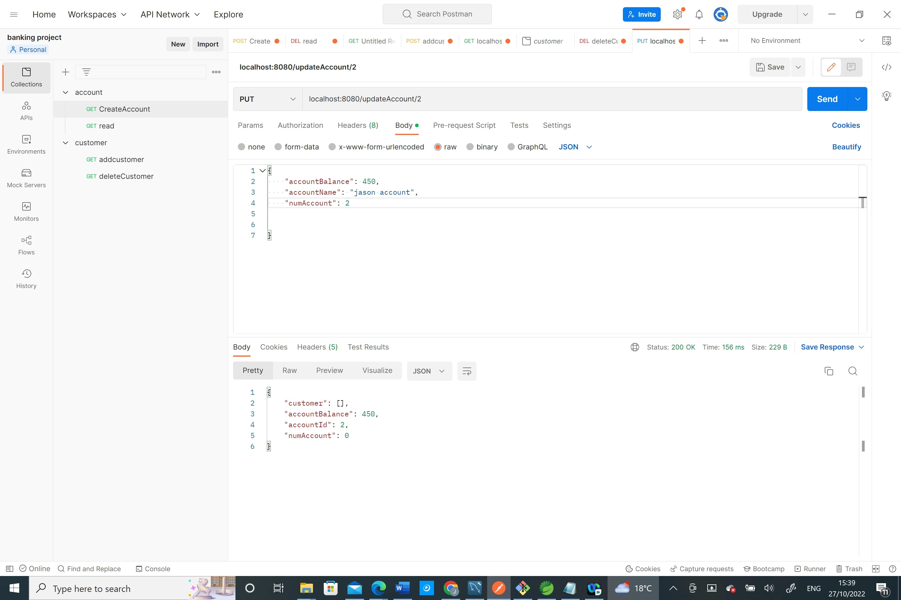

# banking_project
project new
Overview
this project is backend of banking app, which is designed to fetch data from MYSQL Database and exposing data using RESTFUL API

Feature:-
* add an Account
* read all an Account
* update Account
* delete Account
this process would also be proformed on the customer table as well

the structure of the table 

	

### Database 
*below is an ERD diagram for the database table which will show the one to many and many to one relation from Account to Customer 

	

the image is unable to upload due to some issues but i try uploading by dragging into the the README file try to upload it this way, but it you want to view the image is Screenshot (76) in the images file. 

##### Executing
using Postman using in CRUD
this method stand for Create, Read, Update,Delete.  

### Add Account

	

image is is uable to load for some reason but the image is contain in the images file named addaccount.jpg. it show and account has being add from the resopens from Postman and MySQL data base.

##### Delete Account

	

it show that by using delete in Postman request the account has being removes from Account Databas which while using this request 

##### Update account. 
this is an put request under Postman which use to update entry in the account table 

	

the image can be find in the image file for some reason is unable to properly showed but if more information is need the iamge is named update_account 

 ##### ReadAll Account. 
 this is an get request in Postman that directly extract information in the table but the problem of this request is that it can only be view using a localhost:8080/addAccount in an web browser

	

 

### JUNIT testing 
CustomerController test

	

 

this test is used to check the rest controller is initialised

### CRUDE test 
this is a test that create a failed to profrom because it was unable to collect to the X.sql data base which is assigned to 

	

 

###### Instruction for executing project
there are a few thing has to be done constantly, for example Excuting sts, refreshing MySQL droping the Account and Customer Tabel constanting before Executing of runing STS also never repeatativtly runing spring boot application as it will use the same port and casue a error. also make sure port 8080 is always available.  
### Code for add in Postman
{
    "accountBalance": 450,
    "accountName": "jason account",
    "numAccount": 2
}

### request for deleting account
localhost:8080/deleteAccount/1
### update Account 
localhost:8080/updateAccount/2
{
    "accountBalance": 450,
    "accountName": "jason account",
    "numAccount": 2
}
### read all account 
localhost:8080/allAccount
###### 
in future i would like to find out the reason why the image is not uploading it the README file and make sure that i fix the issue with the Junit CRUD test, also consider linking account balance to a third table so it would contain with draw and depositing money, i would also consider making add more example code to the read me file so it can demenstrate other freaure of this project 

### Tool used :-
* java
* sprint BOot (STS4)
* MySQL
* Maven
* GitHub
* git

